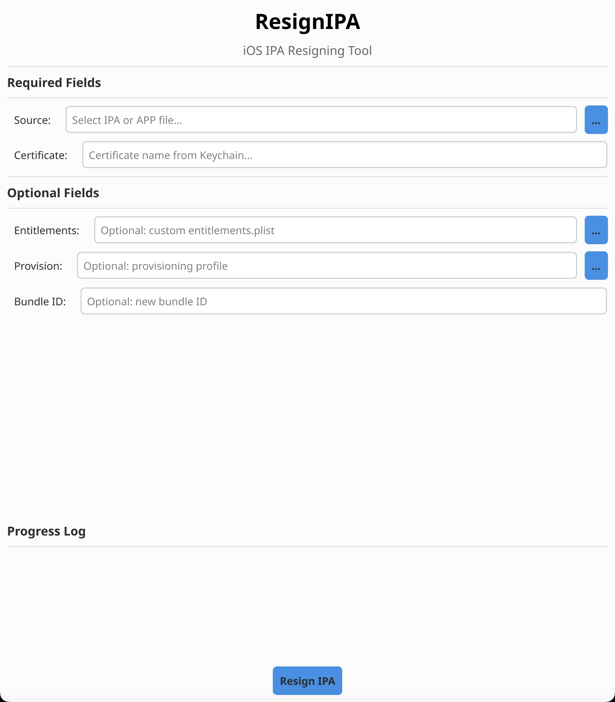

# ResignIPA

iOS IPA Resigning Tool with GUI & CLI



*Professional, compact interface for iOS IPA resigning - Clean white design with light blue accents*

## Quick Start

### Setup & Build
```bash
# Download dependencies (requires network)
make deps

# Build (binary will be in bin/ directory)
make build

# Or manually
go mod download
go build -ldflags="-s -w" -o bin/resignipa main.go
```

### Usage

**🎨 GUI Mode (Recommended for beginners):**
```bash
# Launch the user-friendly GUI interface
./bin/resignipa
# Or use make
make run-gui
```

The GUI provides:
- ✅ **Easy file selection** with Browse buttons
- ✅ **Real-time validation** with helpful error messages  
- ✅ **Progress tracking** with emoji indicators
- ✅ **Field help** explaining what each option does
- ✅ **One-click resigning** with automatic validation

**💻 CLI Mode (For advanced users):**
```bash
# Basic resign (minimal options)
./bin/resignipa -s /path/to/app.ipa -c "Apple Development: Name"

# With provisioning profile (recommended)
./bin/resignipa -s app.ipa -c "Apple Development: Name" -p profile.mobileprovision

# With new bundle ID (for multiple versions)
./bin/resignipa -s app.ipa -c "Apple Development: Name" -b com.company.newapp

# Full options (maximum control)
./bin/resignipa -s app.ipa -c "Apple Development: Name" -p profile.mobileprovision -b com.app.id -e entitlements.plist

# Resign .app bundle (not IPA)
./bin/resignipa -s MyApp.app -c "Apple Development: Name"
```

**🔧 Setup Command:**
```bash
# Verify prerequisites and setup environment
./bin/resignipa setup
# Or use make
make setup
```

## Features

- ✨ **Dual Mode**: User-friendly GUI + powerful CLI from single binary
- 🎨 **Clean Interface**: White background with light blue accents
- 🔒 **Smart Validation**: File existence, format, and permission checks
- 🚀 **Real-time Progress**: Live updates with emoji indicators
- 📦 **Auto-discovery**: Automatically finds and signs all app components
- 💡 **Helpful Guidance**: Built-in tips and troubleshooting
- 🛡️ **Error Prevention**: Validates inputs before processing
- 📁 **Easy File Selection**: Browse buttons for all file inputs

## Requirements

- macOS (required for code signing tools)
- Xcode Command Line Tools
- Valid Apple Developer certificate
- Go 1.21+ (for building)

## Commands

**GUI Commands:**
```bash
./bin/resignipa               # Launch user-friendly GUI interface
make run-gui                  # Launch GUI (builds first if needed)
```

**CLI Commands:**
```bash
./bin/resignipa -s file.ipa -c "Certificate"    # Basic resign
./bin/resignipa resign ...                      # Explicit resign command
./bin/resignipa --help                          # Show detailed help
make run-cli                                     # Show CLI usage examples
```

**Setup & Maintenance:**
```bash
./bin/resignipa setup         # Run setup wizard
make setup                    # Run setup wizard (builds first)
make build                    # Build binary
make clean                    # Clean build artifacts
```

## Build

```bash
make deps       # Download dependencies
make build      # Build binary (outputs to bin/)
make build-all  # Build for all architectures (outputs to build/)
make install    # Install to /usr/local/bin
make clean      # Clean artifacts (removes bin/ and build/)
```

## Finding Certificates

**In GUI:** Use the Browse button next to Certificate field to see available certificates

**In CLI:** Run this command to find your certificate:
```bash
security find-identity -v -p codesigning
```

Example output:
```
1) 1234567890ABC "Apple Development: John Doe (TEAM123456)"
2) ABCDEF1234567 "Apple Distribution: Company Name (TEAM789012)"
```

Use the **exact text in quotes** as the `-c` parameter:
- GUI: Paste into Certificate field
- CLI: `./bin/resignipa -s app.ipa -c "Apple Development: John Doe (TEAM123456)"`

## License

MIT License - See LICENSE file

Based on original XReSign by xndrs (2017)

## User-Friendly Features

### 🎨 GUI Interface
- **Clean white design** with light blue accents
- **Browse buttons** for easy file selection
- **Real-time validation** with helpful error messages
- **Progress tracking** with emoji indicators (🚀📦✍️📁✅)
- **Field help** explaining each option
- **Smart error handling** with troubleshooting tips

### 💻 CLI Interface  
- **Comprehensive validation** before processing
- **File existence checks** for all inputs
- **Extension validation** (.ipa, .app, .plist, .mobileprovision)
- **Bundle ID format checking** (com.company.app)
- **Detailed error messages** with usage examples
- **Context-aware troubleshooting** based on error type

### 🔧 Enhanced Validation
- ✅ Checks if source IPA/APP file exists
- ✅ Validates file extensions (.ipa, .app only)
- ✅ Verifies certificate name format
- ✅ Checks optional files if provided
- ✅ Validates bundle ID format
- ✅ Provides clear error messages with solutions

---

**Status:** Production Ready | **Version:** 1.0.0 | **Platform:** macOS
